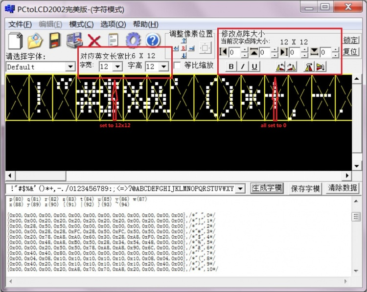
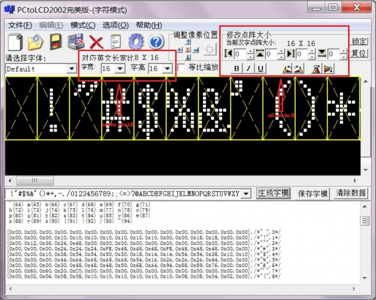
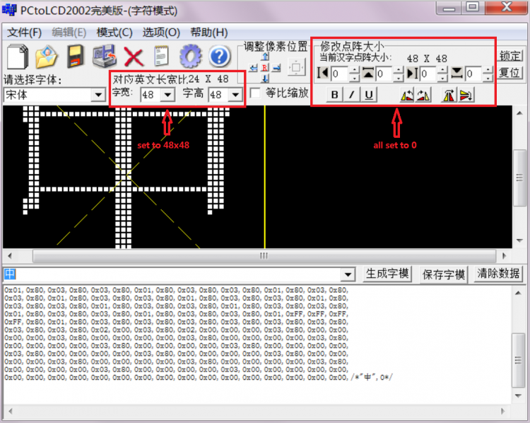

## Molding software configuration

The font modulo software used in the test example is PCtoLCD2002. For detailed instructions on its use, see the following document:

**PCtoLCD2002 Instructions for use**

The PCtoLCD2002 software is specifically set as follows:

- **Font and size selection**


Mode needs to select 字符模式
Fonts can be selected according to needs, such as selection 宋体
The word width and word height can be selected according to the needs. The font sizes commonly used in Chinese and English are as follows:
Chinese (word width x word height):16x16、24x24、32x32、48x48
English (character x word height):6x8、6x12、8x16、12x24、16x32、24x48（The corresponding font size needs to be set to respectively12x8、12x12、16x16、24x24、32x32、48x48）
Modify the dot matrix size can be set according to requirements, generally set to 0

- **Font option setting**

  There are many situations in the Chinese and English font option setting. Different settings and different code processing methods.
  Here is an example of the following settings, the subsequent function code is written based on this setting.

  

  Dot matrix format select 阴码
  Modal mode select 逐行式
  Molding trend select 顺向（高位在前）
  Output number system select 十六进制数
  Custom format select C51格式

## Bottom support function

- **LCD_SetWindows**

The function implementation differs depending on the driver IC (different drive ICs set coordinate values with different commands and principles),
but the principle is basically the same, setting the start and end coordinates and setting a display area.
Examples are as follows (ILI9341 as an example)

```
void LCD_SetWindows(u16 xStar, u16 yStar,u16 xEnd,u16 yEnd)
{	
	LCD_WR_REG(lcddev.setxcmd);	
	LCD_WR_DATA(xStar>>8);
	LCD_WR_DATA(0x00FF&xStar);		
	LCD_WR_DATA(xEnd>>8);
	LCD_WR_DATA(0x00FF&xEnd);

	LCD_WR_REG(lcddev.setycmd);	
	LCD_WR_DATA(yStar>>8);
	LCD_WR_DATA(0x00FF&yStar);		
	LCD_WR_DATA(yEnd>>8);
	LCD_WR_DATA(0x00FF&yEnd);

	LCD_WriteRAM_Prepare();	//Start writing to GRAM		
}
```

- **Lcd_WriteData_16Bit**

```
void Lcd_WriteData_16Bit(u16 Data)
{	
      LCD_CS_CLR;
      LCD_RS_SET;  
      SPI_WriteByte(SPI2,Data>>8);
      SPI_WriteByte(SPI2,Data);
      LCD_CS_SET;
}
```

- **LCD_DrawPoint**

In fact, the LCD_SetWindows function and the Lcd_WriteData_16Bit function are used to display a pixel.
Examples are as follows (ILI9341 as an example)

```
void LCD_DrawPoint(u16 x,u16 y)
{
	LCD_SetCursor(x,y);//Set the cursor position
	Lcd_WriteData_16Bit(POINT_COLOR); 
}
```

## English character modulo

### Important note

1.Because in the program, the English characters that need to be displayed are searched according to the ASCII offset,
so the entire set of ASCII characters needs to be modeled.
2.If you do not need to use a character, you can set the modulo data of the character to {0},
as shown in the following example (take 6x8 size characters as an example)

```
const unsigned char asc2_0806[95][8]={
   ...  //This example is omitted, the actual application needs to be added
{0},/*"2",18*/ Do not use number 2
{0x00,0x00,0x78,0xB0,0x08,0x88,0x70,0x00},/*"3",19*/
{0x00,0x00,0x30,0x50,0x90,0x78,0x10,0x00},/*"4",20*/
{0},/*"5",21*/ Do not use number 5
{0x00,0x00,0x70,0x80,0xF8,0x88,0x70,0x00},/*"6",22*/
{0},/*"7",23*/ Do not use number 7
{0x00,0x00,0xF8,0x88,0x70,0x88,0x78,0x00},/*"8",24*/
{0},/*"9",25*/ Do not use number 9
   ...  //This example is omitted, the actual application needs to be added
}
```

3.The ASCII characters are as follows (the first space is also included):
ASCII characters: !"#$%&'()*+,-./0123456789:;<=>?@ABCDEFGHIJKLMNOPQRSTUVWXYZ[\]^_`abcdefghijklmnopqrstuvwxyz{|}~
4.The English modulo data fonts are all Default

- **The different sizes of English character modulo description**

##### 6x8 English font modulo description

The size settings are as shown below:


The function is defined as follows:

```
void LCD_Show_1206_char(u16 x,u16 y,u16 fc, u16 bc, u8 num,u8 mode)
{
    u8 temp;
    u8 pos,t;
    u16 colortemp=POINT_COLOR;      		   
    num=num-' ';//Get the offset value
    LCD_SetWindows(x,y,x+6-1,y+12-1);//Set a single text display window
    if(!mode) //Non-overlay mode: The font has a background color, which will overwrite the original display
    {		
        for(pos=0;pos<12;pos++)
	{
	    temp = asc2_1206[num][pos];//Call 1206 font, you need to take the model definition
	    for(t=0;t<6;t++)
            {                 
		if(temp&0x80)
		{
		    Lcd_WriteData_16Bit(fc);
		}
		else 
		{
		    Lcd_WriteData_16Bit(bc); 
		}
		temp<<=1;
	    }
			
	}	
    }
    else//Overlay mode: the font does not have a background color, and is directly superimposed and displayed on the original display content
    {
	for(pos=0;pos<12;pos++)
	{
	    temp = asc2_1206[num][pos];//Call 1206 font, you need to take the model definition
	    for(t=0;t<6;t++)
	    {   
		POINT_COLOR=fc;              
		if(temp&0x80)
		{
		    LCD_DrawPoint(x+t,y+pos);//Draw a point    
		}
		temp<<=1;
	    }
	}
    }
    POINT_COLOR=colortemp;	
    LCD_SetWindows(0,0,lcddev.width-1,lcddev.height-1);//Restore window to full screen         	   
}
```

##### 6x12 English font modulo description

The size settings are as shown below:



The function is defined as follows:

```
void LCD_Show_1206_char(u16 x,u16 y,u16 fc, u16 bc, u8 num,u8 mode)
{
    u8 temp;
    u8 pos,t;
    u16 colortemp=POINT_COLOR;      		   
    num=num-' ';//Get the offset value
    LCD_SetWindows(x,y,x+6-1,y+12-1);//Set a single text display window
    if(!mode) //Non-overlay mode: The font has a background color, which will overwrite the original display
    {		
        for(pos=0;pos<12;pos++)
	{
	    temp = asc2_1206[num][pos];//Call 1206 font, you need to take the model definition
	    for(t=0;t<6;t++)
            {                 
		if(temp&0x80)
		{
		    Lcd_WriteData_16Bit(fc);
		}
		else 
		{
		    Lcd_WriteData_16Bit(bc); 
		}
		temp<<=1;
	    }
			
	}	
    }
    else//Overlay mode: the font does not have a background color, and is directly superimposed and displayed on the original display content
    {
	for(pos=0;pos<12;pos++)
	{
	    temp = asc2_1206[num][pos];//Call 1206 font, you need to take the model definition
	    for(t=0;t<6;t++)
	    {   
		POINT_COLOR=fc;              
		if(temp&0x80)
		{
		    LCD_DrawPoint(x+t,y+pos);//Draw a point    
		}
		temp<<=1;
	    }
	}
    }
    POINT_COLOR=colortemp;	
    LCD_SetWindows(0,0,lcddev.width-1,lcddev.height-1);//Restore window to full screen         	   
}
```


##### 8x16 English font modulo description

The size settings are as shown below:



The function is defined as follows:

```
void LCD_Show_1608_char(u16 x,u16 y,u16 fc, u16 bc, u8 num,u8 mode)
{
    u8 temp;
    u8 pos,t;
    u16 colortemp=POINT_COLOR;      		   
    num=num-' ';//Get the offset value
    LCD_SetWindows(x,y,x+8-1,y+16-1);//Set a single text display window
    if(!mode) //Non-overlay mode: The font has a background color, which will overwrite the original display
    {		
	for(pos=0;pos<16;pos++)
	{
	    temp = asc2_1608[num][pos];//Call 1608 font, you need to take the model definition
	    for(t=0;t<8;t++)
            {                 
		if(temp&0x80)
	        {
		    Lcd_WriteData_16Bit(fc);
		}
		else 
		{
		    Lcd_WriteData_16Bit(bc); 
		}
		temp<<=1;
	    }
	}	
    }
    else//Overlay mode: the font does not have a background color, and is directly superimposed and displayed on the original display content
    {
	for(pos=0;pos<16;pos++)
	{
	    temp = asc2_1608[num][pos];//Call 1608 font, you need to take the model definition
	    for(t=0;t<8;t++)
	    {   
		POINT_COLOR=fc;              
		if(temp&0x80)
		{
		    LCD_DrawPoint(x+t,y+pos);//Draw a point    
		}
		temp<<=1;
	    }
	}
    }
    POINT_COLOR=colortemp;	
    LCD_SetWindows(0,0,lcddev.width-1,lcddev.height-1);//Restore window to full screen          	   
}
```

##### 12x24 English font modulo description

The size settings are as shown below:


The function is defined as follows:

```
void LCD_Show_2412_char(u16 x,u16 y,u16 fc, u16 bc, u8 num,u8 mode)
{
    u16 temp;
    u8 pos,t;
    u16 colortemp=POINT_COLOR;      		   
    num=num-' ';//Get the offset value
    LCD_SetWindows(x,y,x+12-1,y+24-1);//Set a single text display window
    if(!mode) //Non-overlay mode: The font has a background color, which will overwrite the original display
    {		
	for(pos=0;pos<24;pos++)
	{
	    temp = (asc2_2412[num][pos*2]<<8)|asc2_2412[num][pos*2+1];//Call 2412 font, you need to take the model definition
	    for(t=0;t<12;t++)
	    {                 
	        if(temp&0x8000)
		{
		    Lcd_WriteData_16Bit(fc);
		}
		else 
		{
		    Lcd_WriteData_16Bit(bc); 
		}
		temp<<=1;
	    }
	}	
    }
    else//Overlay mode: the font does not have a background color, and is directly superimposed and displayed on the original display content
    {
	for(pos=0;pos<24;pos++)
        {
	    temp = (asc2_2412[num][pos*2]<<8)|asc2_2412[num][pos*2+1];//Call 2412 font, you need to take the model definition
	    for(t=0;t<12;t++)
	    {   
		POINT_COLOR=fc;              
		if(temp&0x8000)
		{
		    LCD_DrawPoint(x+t,y+pos);//Draw a point     
		}
		temp<<=1;
	    }
        }
    }
    POINT_COLOR=colortemp;	
    LCD_SetWindows(0,0,lcddev.width-1,lcddev.height-1);//Restore window to full screen       	   
}
```

##### 16x32 English font modulo description

The size settings are as shown below:


The function is defined as follows:

```
void LCD_Show_3216_char(u16 x,u16 y,u16 fc, u16 bc, u8 num,u8 mode)
{
    u16 temp;
    u8 pos,t;
    u16 colortemp=POINT_COLOR;      		   
    num=num-' ';//Get the offset value
    LCD_SetWindows(x,y,x+16-1,y+32-1);//Set a single text display window
    if(!mode) //Non-overlay mode: The font has a background color, which will overwrite the original display
    {		
	for(pos=0;pos<32;pos++)
	{
	    temp = (asc2_3216[num][pos*2]<<8)|asc2_3216[num][pos*2+1];//Call 3216 font, you need to take the model definition
	    for(t=0;t<16;t++)
	    {                 
		if(temp&0x8000)
		{
		    Lcd_WriteData_16Bit(fc);
		}
		else 
		{
		    Lcd_WriteData_16Bit(bc); 
		}
		temp<<=1;
	    }
			
	}	
    }
    else//Overlay mode: the font does not have a background color, and is directly superimposed and displayed on the original display content
    {
        for(pos=0;pos<32;pos++)
	{
	    temp = (asc2_3216[num][pos*2]<<8)|asc2_3216[num][pos*2+1];//Call 3216 font, you need to take the model definition
	    for(t=0;t<16;t++)
	    {   
		POINT_COLOR=fc;              
		if(temp&(0x8000))
		{
		    LCD_DrawPoint(x+t,y+pos);//Draw a point    
		}
		temp<<=1;
	    }
	}
    }
    POINT_COLOR=colortemp;	
    LCD_SetWindows(0,0,lcddev.width-1,lcddev.height-1);//Restore window to full screen       	   
}
```

##### 24x48 English font modulo description

The size settings are as shown below:


The function is defined as follows:

```
void LCD_Show_4824_char(u16 x,u16 y,u16 fc, u16 bc, u8 num,u8 mode)
{
    u32 temp;
    u8 pos,t;
    u16 colortemp=POINT_COLOR;      		   
    num=num-' ';//Get the offset value
    LCD_SetWindows(x,y,x+24-1,y+48-1);//Set a single text display window
    if(!mode) //Non-overlay mode: The font has a background color, which will overwrite the original display
    {		
	for(pos=0;pos<48;pos++)
	{
	    temp = (asc2_4824[num][pos*3]<<16)|(asc2_4824[num][pos*3+1]<<8)|asc2_4824[num][pos*3+2];//Call 4824 font, you need to take the model definition
	    for(t=0;t<24;t++)
	    {                 
		if(temp&0x800000)
		{
		    Lcd_WriteData_16Bit(fc);
		}
		else 
		{
		    Lcd_WriteData_16Bit(bc); 
		}
		temp<<=1;
	    }
			
	}	
    }
    else//Overlay mode: the font does not have a background color, and is directly superimposed and displayed on the original display content
    {
        for(pos=0;pos<48;pos++)
	{
	    temp = (asc2_4824[num][pos*3]<<16)|(asc2_4824[num][pos*3+1]<<8)|asc2_4824[num][pos*3+2];//Call 4824 font, you need to take the model definition
	    for(t=0;t<24;t++)
	    {   
		POINT_COLOR=fc;              
		if(temp&(0x800000))
		{
		    LCD_DrawPoint(x+t,y+pos);//Draw a point    
		}
		temp<<=1;
	    }
	}
    }
    POINT_COLOR=colortemp;	
    LCD_SetWindows(0,0,lcddev.width-1,lcddev.height-1);//Restore window to full screen  
}
```

##### 32x64 English font modulo description

The size settings are as shown below:


The function is defined as follows:

```
void LCD_Show_6432_char(u16 x,u16 y,u16 fc, u16 bc, u8 num,u8 mode)
{
    u32 temp;
    u8 pos,t;
    u16 colortemp=POINT_COLOR;      		   
    num=num-' ';//Get the offset value
    LCD_SetWindows(x,y,x+32-1,y+64-1);//Set a single text display window
    if(!mode) //Non-overlay mode: The font has a background color, which will overwrite the original display
    {		
	for(pos=0;pos<64;pos++)
	{
	    temp = (asc2_6432[num][pos*4]<<24)|(asc2_6432[num][pos*4+1]<<16)|(asc2_6432[num][pos*4+2]<<8)|asc2_6432[num][pos*4+3];//Call 6432 font, you need to take the model definition
	    for(t=0;t<32;t++)
	    {                 
		if(temp&0x80000000)
		{
		    Lcd_WriteData_16Bit(fc);
		}
		else 
		{
		    Lcd_WriteData_16Bit(bc); 
		}
		temp<<=1;
	    }
			
	}	
    }
    else//Overlay mode: the font does not have a background color, and is directly superimposed and displayed on the original display content
    {
        for(pos=0;pos<64;pos++)
	{
	    temp = (asc2_6432[num][pos*4]<<24)|(asc2_6432[num][pos*4+1]<<16)|(asc2_6432[num][pos*4+2]<<8)|asc2_6432[num][pos*4+3];//Call 6432 font, you need to take the model definition
	    for(t=0;t<32;t++)
	    {   
		POINT_COLOR=fc;              
		if(temp&0x80000000)
		{
		    LCD_DrawPoint(x+t,y+pos);//Draw a point 
		}
		temp<<=1;
	    }
	}
    }
    POINT_COLOR=colortemp;	
    LCD_SetWindows(0,0,lcddev.width-1,lcddev.height-1);//Restore window to full screen  
}
```

##### 48x96 English font modulo description

The size settings are as shown below:


The function is defined as follows:

```
void LCD_Show_9648_char(u16 x,u16 y,u16 fc, u16 bc, u8 num,u8 mode)
{
    u32 temp;
    u8 pos,t,i;
    u16 colortemp=POINT_COLOR;      		   
    num=num-' ';//Get the offset value
    LCD_SetWindows(x,y,x+48-1,y+96-1);//Set a single text display window
    if(!mode) //Non-overlay mode: The font has a background color, which will overwrite the original display
    {		
	for(pos=0;pos<96;pos++)
	{
	     for(i=0;i<2;i++)
	     {
		 temp = (asc2_9648[num][pos*6+i*3]<<16)|(asc2_9648[num][pos*6+i*3+1]<<8)|asc2_9648[num][pos*6+i*3+2];//Call 9648 font, you need to take the model definition
	        for(t=0;t<24;t++)
	        {                 
		   if(temp&0x800000)
		   {
		      Lcd_WriteData_16Bit(fc);
		   }
		   else 
		   {
		      Lcd_WriteData_16Bit(bc); 
		   }
		   temp<<=1;
	        }	
	    }	
	}
    }
    else//Overlay mode: the font does not have a background color, and is directly superimposed and displayed on the original display content
    {
        for(pos=0;pos<96;pos++)
	{
	    for(i=0;i<2;i++)
	    {
	        temp = (asc2_9648[num][pos*6+i*3]<<16)|(asc2_9648[num][pos*6+i*3+1]<<8)|asc2_9648[num][pos*6+i*3+2];//Call 9648 font, you need to take the model definition
	        for(t=0;t<24;t++)
	        {   
		    POINT_COLOR=fc;              
		    if(temp&0x800000)
		    {
		        LCD_DrawPoint(x+i*24+t,y+pos);//Draw a point    
		    }
		    temp<<=1;
	        }
	    }
	}
    }
    POINT_COLOR=colortemp;	
    LCD_SetWindows(0,0,lcddev.width-1,lcddev.height-1);//Restore window to full screen
}
```


##### 64x128 English font modulo description


The function is defined as follows:

```
void LCD_Show_12864_char(u16 x,u16 y,u16 fc, u16 bc, u8 num,u8 mode)
{
    u32 temp;
    u8 pos,t,i;
    u16 colortemp=POINT_COLOR;      		   
    num=num-' ';//Get the offset value
    LCD_SetWindows(x,y,x+64-1,y+128-1);//Set a single text display window
    if(!mode) //Non-overlay mode: The font has a background color, which will overwrite the original display
    {		
	for(pos=0;pos<128;pos++)
	{
	    for(i=0;i<2;i++)
	    {
	        temp = (asc2_12864[num][pos*8+i*4]<<24)|(asc2_12864[num][pos*8+i*4+1]<<16)|(asc2_12864[num][pos*8+i*4+2]<<8)|asc2_12864[num][pos*8+i*4+3];//Call 12864 font, you need to take the model definition
	        for(t=0;t<32;t++)
	        {                 
		    if(temp&0x80000000)
		    {
		        Lcd_WriteData_16Bit(fc);
		    }
		    else 
		    {
		        Lcd_WriteData_16Bit(bc); 
		    }
		    temp<<=1;
	        }
            }		
	}	
    }
    else//Overlay mode: the font does not have a background color, and is directly superimposed and displayed on the original display content
    {
        for(pos=0;pos<128;pos++)
	{
	     for(i=0;i<2;i++)
	     {
	         temp = (asc2_12864[num][pos*8+i*4]<<24)|(asc2_12864[num][pos*8+i*4+1]<<16)|(asc2_12864[num][pos*8+i*4+2]<<8)|asc2_12864[num][pos*8+i*4+3];//Call 12864 font, you need to take the model definition
	         for(t=0;t<32;t++)
	         {   
		     POINT_COLOR=fc;              
		     if(temp&0x80000000)
		     {
		         LCD_DrawPoint(x+i*32+t,y+pos);//Draw a point      
		     }
		     temp<<=1;
	        }
	    }
	}
    }
    POINT_COLOR=colortemp;	
    LCD_SetWindows(0,0,lcddev.width-1,lcddev.height-1);//Restore window to full screen  
}
```

## Chinese character modulo

- **[Important note](http://www.lcdwiki.com/Chinese_and_English_display_modulo_settings#Chinese_character_modulo)**

1.When displaying Chinese characters, the modulo data is obtained by querying the GBK code that needs to display Chinese characters;
2.After the Chinese character is successfully modulo, the corresponding relationship between the Chinese character GBK code and the modulo data is saved through an array of structures.
3.The structure is defined as follows:

```
//16x16 Chinese font structure definition
typedef struct 
{
       unsigned char Index[2];	//Store Chinese character GBK code
       char Msk[32]; //Store Chinese character modulo data
}typFNT_GB16;  //Structure name can be defined by yourself

\\\\\\\\\\\\\\\\\\\\\\\\\\\\\\\\\\\\\\\\\\\\\\\\\\\\\\\\\\\\\\\\\\\\\\\\\
//24x24 Chinese font structure definition
typedef struct 
{
       unsigned char Index[2];	//Store Chinese character GBK code
       char Msk[72]; //Store Chinese character modulo data
}typFNT_GB24;  //Structure name can be defined by yourself

\\\\\\\\\\\\\\\\\\\\\\\\\\\\\\\\\\\\\\\\\\\\\\\\\\\\\\\\\\\\\\\\\\\\\\\\\
//32x32 Chinese font structure definition
typedef struct 
{
       unsigned char Index[2];	//Store Chinese character GBK code
       char Msk[128]; //Store Chinese character modulo data
}typFNT_GB32;  //Structure name can be defined by yourself

\\\\\\\\\\\\\\\\\\\\\\\\\\\\\\\\\\\\\\\\\\\\\\\\\\\\\\\\\\\\\\\\\\\\\\\\\
//48x48 Chinese font structure definition
typedef struct 
{
       unsigned char Index[2];	//Store Chinese character GBK code
       char Msk[288]; //Store Chinese character modulo data
}typFNT_GB48; //Structure name can be defined by yourself
```

- **The different sizes of Chinese modulo description**

##### 16x16 Chinese font modulo description

The size settings are as shown below:


```
const typFNT_GB16 tfont16[]=   
{
  "中",0x01,0x00,0x01,0x00,0x01,0x00,0x01,0x00,0x3F,0xF8,0x21,0x08,0x21,0x08,0x21,0x08,
  0x21,0x08,0x21,0x08,0x3F,0xF8,0x21,0x08,0x01,0x00,0x01,0x00,0x01,0x00,0x01,0x00,
};
```

The function is defined as follows:

```
void GUI_DrawFont16(u16 x, u16 y, u16 fc, u16 bc, u8 *s,u8 mode)
{
   u8 i,j;
   u16 k;
   u16 HZnum;
   u16 x0=x;
   HZnum=sizeof(tfont16)/sizeof(typFNT_GB16);	//Automatic statistics of the number of Chinese characters
   for (k=0;k<HZnum;k++) 
   {
       if((tfont16[k].Index[0]==*(s))&&(tfont16[k].Index[1]==*(s+1)))
       { 	
           LCD_SetWindows(x,y,x+16-1,y+16-1);
	   for(i=0;i<16*2;i++)
           {
		for(j=0;j<8;j++)
		{	
		     if(!mode) //Non-overlay mode: The font has a background color, which will overwrite the original display
		     {
			  if(tfont16[k].Msk[i]&(0x80>>j))
                          {	
                               Lcd_WriteData_16Bit(fc);
                          }			  
                          else 
                          {
                               Lcd_WriteData_16Bit(bc);
			  }
		     }
		     else //Overlay mode: the font does not have a background color, and is directly superimposed and displayed on the original display content
		     {
			  POINT_COLOR=fc;
			  if(tfont16[k].Msk[i]&(0x80>>j))						
                          {
                               LCD_DrawPoint(x,y);//Draw a point  
			  }
			  x++;
			  if((x-x0)==16)
			  {
			       x=x0;
			       y++;
			       break;
			  }
		     }
	        }
	    }
	 }				  	
	 continue;  //Find the corresponding dot matrix font to exit immediately, to prevent the impact of multiple Chinese characters repeated modulo
    }
    LCD_SetWindows(0,0,lcddev.width-1,lcddev.height-1);//Restore window to full screen
}
```


##### 24x24 Chinese font modulo description

The size settings are as shown below:


```
const typFNT_GB24 tfont24[]=
{
  "中",0x00,0x00,0x00,0x00,0x00,0x00,0x00,0x18,0x00,0x00,0x10,0x00,0x00,0x10,0x00,0x00,
  0x10,0x00,0x10,0x10,0x18,0x1F,0xFF,0xF8,0x18,0x10,0x18,0x18,0x10,0x18,0x18,0x10,
  0x18,0x18,0x10,0x18,0x18,0x10,0x18,0x18,0x10,0x18,0x1F,0xFF,0xF8,0x10,0x10,0x10,
  0x00,0x10,0x00,0x00,0x10,0x00,0x00,0x10,0x00,0x00,0x10,0x00,0x00,0x18,0x00,0x00,
  0x18,0x00,0x00,0x18,0x00,0x00,0x00,0x00,
};
```

The function is defined as follows:

```
void GUI_DrawFont24(u16 x, u16 y, u16 fc, u16 bc, u8 *s,u8 mode)
{
    u8 i,j;
    u16 k;
    u16 HZnum;
    u16 x0=x;
    HZnum=sizeof(tfont24)/sizeof(typFNT_GB24);	//Automatic statistics of the number of Chinese characters
    for (k=0;k<HZnum;k++) 
    {
        if((tfont24[k].Index[0]==*(s))&&(tfont24[k].Index[1]==*(s+1)))
        { 	
             LCD_SetWindows(x,y,x+24-1,y+24-1);
	     for(i=0;i<24*3;i++)
	     {
		  for(j=0;j<8;j++)
		  {
			if(!mode) //Non-overlay mode: The font has a background color, which will overwrite the original display
			{
                              if(tfont24[k].Msk[i]&(0x80>>j))
                              {	 
                                   Lcd_WriteData_16Bit(fc);
			      }						
                              else 
                              {
                                   Lcd_WriteData_16Bit(bc);
			      }					
                        }
		        else //Overlay mode: the font does not have a background color, and is directly superimposed and displayed on the original display content
		        {
			      POINT_COLOR=fc;
			      if(tfont24[k].Msk[i]&(0x80>>j))
                              { 
                                   LCD_DrawPoint(x,y);// Draw a point
			      }					
                              x++;
			      if((x-x0)==24)
			      {
				   x=x0;
				   y++;
				   break;
			      }
		         }
		   }
	      }
	 }				  	
	 continue;  //Find the corresponding dot matrix font to exit immediately, to prevent the impact of multiple Chinese characters repeated modulo
    }
    LCD_SetWindows(0,0,lcddev.width-1,lcddev.height-1);// Restore window to full screen
}
```

##### 32x32 Chinese font modulo description

The size settings are as shown below:


```
const typFNT_GB32 tfont32[]=
{
  "中",0x00,0x00,0x00,0x00,0x00,0x00,0x00,0x00,0x00,0x01,0x00,0x00,0x00,0x01,0x80,0x00,
  0x00,0x01,0x80,0x00,0x00,0x01,0x80,0x00,0x00,0x01,0x80,0x00,0x00,0x01,0x80,0x00,
  0x08,0x01,0x80,0x30,0x0F,0xFF,0xFF,0xF0,0x0C,0x01,0x80,0x20,0x0C,0x01,0x80,0x20,
  0x0C,0x01,0x80,0x20,0x0C,0x01,0x80,0x20,0x0C,0x01,0x80,0x20,0x0C,0x01,0x80,0x20,
  0x0C,0x01,0x80,0x20,0x0C,0x01,0x80,0x20,0x0F,0xFF,0xFF,0xE0,0x0C,0x01,0x80,0x20,
  0x0C,0x01,0x80,0x20,0x00,0x01,0x80,0x00,0x00,0x01,0x80,0x00,0x00,0x01,0x80,0x00,
  0x00,0x01,0x80,0x00,0x00,0x01,0x80,0x00,0x00,0x01,0x80,0x00,0x00,0x01,0x80,0x00,
  0x00,0x01,0x80,0x00,0x00,0x01,0x80,0x00,0x00,0x01,0x00,0x00,0x00,0x00,0x00,0x00,
};
```

The function is defined as follows:

```
void GUI_DrawFont32(u16 x, u16 y, u16 fc, u16 bc, u8 *s,u8 mode)
{
    u8 i,j;
    u16 k;
    u16 HZnum;
    u16 x0=x;
    HZnum=sizeof(tfont32)/sizeof(typFNT_GB32);	//Automatic statistics of the number of Chinese characters
    for (k=0;k<HZnum;k++) 
    {
	 if ((tfont32[k].Index[0]==*(s))&&(tfont32[k].Index[1]==*(s+1)))
	 { 	
               LCD_SetWindows(x,y,x+32-1,y+32-1);
	       for(i=0;i<32*4;i++)
	       {
		     for(j=0;j<8;j++)
	             {
			   if(!mode) //Non-overlay mode: The font has a background color, which will overwrite the original display
			   {
				if(tfont32[k].Msk[i]&(0x80>>j))
                                {
				      Lcd_WriteData_16Bit(fc);
                                }				
				else 
                                {
                                      Lcd_WriteData_16Bit(bc);
				}			
                           }
			   else //Overlay mode: the font does not have a background color, and is directly superimposed and displayed on the original display content
			   {
				POINT_COLOR=fc;
			        if(tfont32[k].Msk[i]&(0x80>>j))
                                {
                                      LCD_DrawPoint(x,y);// Draw a point
				}		
		                x++;
				if((x-x0)==32)
				{
				      x=x0;
				      y++;
				      break;
				}
			   }
		      }
		}
	  }				  	
	  continue;  //Find the corresponding dot matrix font to exit immediately, to prevent the impact of multiple Chinese characters repeated modulo
     }
     LCD_SetWindows(0,0,lcddev.width-1,lcddev.height-1);// Restore window to full screen
}
```


##### 48x48 Chinese font modulo description



```
const typFNT_GB48 tfont48[]=
{
    "中",0x00,0x00,0x00,0x00,0x00,0x00,0x00,0x00,0x00,0x00,0x00,0x00,0x00,0x00,0x03,0x00,
    0x00,0x00,0x00,0x00,0x03,0xC0,0x00,0x00,0x00,0x00,0x03,0xC0,0x00,0x00,0x00,0x00,
    0x03,0x80,0x00,0x00,0x00,0x00,0x03,0x80,0x00,0x00,0x00,0x00,0x03,0x80,0x00,0x00,
    0x00,0x00,0x03,0x80,0x00,0x00,0x00,0x00,0x03,0x80,0x00,0x00,0x00,0x00,0x03,0x80,
    0x00,0x00,0x02,0x00,0x03,0x80,0x01,0x80,0x03,0x80,0x03,0x80,0x03,0xC0,0x03,0xFF,
    0xFF,0xFF,0xFF,0xC0,0x03,0x80,0x03,0x80,0x03,0x80,0x01,0x80,0x03,0x80,0x03,0x80,
    0x01,0x80,0x03,0x80,0x03,0x80,0x01,0x80,0x03,0x80,0x03,0x80,0x01,0x80,0x03,0x80,
    0x03,0x80,0x01,0x80,0x03,0x80,0x03,0x80,0x01,0x80,0x03,0x80,0x03,0x80,0x01,0x80,
    0x03,0x80,0x03,0x80,0x01,0x80,0x03,0x80,0x03,0x80,0x01,0x80,0x03,0x80,0x03,0x80,
    0x01,0x80,0x03,0x80,0x03,0x80,0x01,0x80,0x03,0x80,0x03,0x80,0x01,0xFF,0xFF,0xFF,
    0xFF,0x80,0x01,0x80,0x03,0x80,0x03,0x80,0x03,0x80,0x03,0x80,0x03,0x80,0x03,0x80,
    0x03,0x80,0x03,0x80,0x02,0x00,0x03,0x80,0x02,0x00,0x00,0x00,0x03,0x80,0x00,0x00,
    0x00,0x00,0x03,0x80,0x00,0x00,0x00,0x00,0x03,0x80,0x00,0x00,0x00,0x00,0x03,0x80,
    0x00,0x00,0x00,0x00,0x03,0x80,0x00,0x00,0x00,0x00,0x03,0x80,0x00,0x00,0x00,0x00,
    0x03,0x80,0x00,0x00,0x00,0x00,0x03,0x80,0x00,0x00,0x00,0x00,0x03,0x80,0x00,0x00,
    0x00,0x00,0x03,0x80,0x00,0x00,0x00,0x00,0x03,0x80,0x00,0x00,0x00,0x00,0x03,0x80,
    0x00,0x00,0x00,0x00,0x03,0x80,0x00,0x00,0x00,0x00,0x03,0x00,0x00,0x00,0x00,0x00,
    0x00,0x00,0x00,0x00,0x00,0x00,0x00,0x00,0x00,0x00,0x00,0x00,0x00,0x00,0x00,0x00,
};
```

The function is defined as follows:

```
void GUI_DrawFont48(u16 x, u16 y, u16 fc, u16 bc, u8 *s,u8 mode)
{
    u8 j;
    u16 k,i;
    u16 HZnum;
    u16 x0=x;
    HZnum=sizeof(tfont48)/sizeof(typFNT_GB48);	//Automatic statistics of the number of Chinese characters
    for (k=0;k<HZnum;k++) 
    {
        if ((tfont48[k].Index[0]==*(s))&&(tfont48[k].Index[1]==*(s+1)))
        { 	
            LCD_SetWindows(x,y,x+48-1,y+48-1);
	    for(i=0;i<48*6;i++)
	    {
	        for(j=0;j<8;j++)
		{
		    if(!mode) //Non-overlay mode: The font has a background color, which will overwrite the original display
		    {
			if(tfont48[k].Msk[i]&(0x80>>j))	
                        {                        
                            Lcd_WriteData_16Bit(fc);
			}
                        else
                        { 
                            Lcd_WriteData_16Bit(bc);
			}				
                    }
		    else //Overlay mode: the font does not have a background color, and is directly superimposed and displayed on the original display content
		    {
			POINT_COLOR=fc;
			if(tfont48[k].Msk[i]&(0x80>>j))	
                        {                        
                            LCD_DrawPoint(x,y);//Draw a point
                        }
			x++;
			if((x-x0)==48)
			{
			    x=x0;
			    y++;
			    break;
			}
		    }
		}
	    }
        }				  	
        continue;  //Find the corresponding dot matrix font to exit immediately, to prevent the impact of multiple Chinese characters repeated modulo
    }	
    LCD_SetWindows(0,0,lcddev.width-1,lcddev.height-1);//Restore window to full screen  
}
```